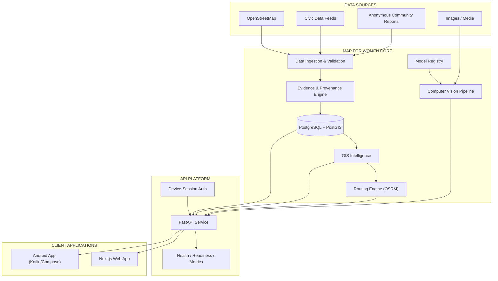

# 🛡️ Map for Women

### AI-Powered Women's Safety Intelligence Platform

> A full-stack safety intelligence platform combining AI-powered computer vision, GIS, civic data,
> evidence analysis, intelligent routing, real-time safety workflows, and emergency assistance.


---

## 📌 Table of Contents

- [Project Snapshot](#-project-snapshot)
- [Key Features](#-key-features)
- [System Architecture](#-system-architecture)
- [Architecture Explanation](#-architecture-explanation)
- [Repository Structure](#-repository-structure)
- [AI / Computer Vision](#-ai--computer-vision)
- [Model Registry](#-model-registry)
- [GIS Architecture](#-gis-architecture)
- [Data & Evidence Architecture](#-data--evidence-architecture)
- [Frontend](#-frontend)
- [Backend](#-backend)
- [Monitoring](#-monitoring)
- [Testing & Quality](#-testing--quality)
- [Performance](#-performance)
- [Security](#-security)
- [Technology Stack](#-technology-stack)
- [Quick Start](#-quick-start)
- [API Quick Reference](#-api-quick-reference)
- [Responsible AI](#-responsible-ai)
- [Project Highlights](#-why-map-for-women)
- [Future Expansion](#-future-expansion)

---

## 📊 Project Snapshot

```
┌────────────────────────────────────────────────────────────────┐
│                        MAP FOR WOMEN                            │
├────────────────────────────────────────────────────────────────┤
│  🤖 AI / Computer Vision         — CV inference pipeline        │
│  🗺️  GIS & Intelligent Routing   — OSRM + PostGIS + Leaflet     │
│  📊 Evidence-Based Intelligence  — provenance & freshness       │
│  🚨 Emergency & SOS Workflows    — guardian, check-ins, voice   │
│  🌐 Full-Stack Web Platform      — Next.js 16 + FastAPI         │
│  📱 Android Application          — Kotlin / Compose client      │
│  🔐 Security & Privacy Controls  — tokens, headers, PII-safe    │
│  📈 Monitoring & Observability   — health, readiness, metrics   │
└────────────────────────────────────────────────────────────────┘
```

**Map for Women** is a safety-aware navigation platform that combines routing, safety evidence,
freshness, confidence, uncertainty, and explainability to provide route alternatives for women
navigating urban areas — especially after dark or in unfamiliar places. Every safety decision is
deterministic, traceable, tested, and versioned.

```text
AI Detection (CV inference pipeline — gated, registry-managed)
       ↓
Risk Analysis (deterministic evidence + risk engine, per road segment)
       ↓
Safety Decision Support (three route profiles, confidence + uncertainty)
       ↓
Alert / Dashboard / GIS Integration (maps, overlays, heatmap, SOS, reports)
```

---

## ✨ Key Features

### 🤖 AI & Computer Vision

- Modular CV inference interface with **preprocessing → inference → postprocessing** pipeline
- Model registry with versioned checkpoints, input/output schemas, and lifecycle tracking
- CV backend health monitoring (`is_real_inference` honest reporting, model load status)
- Prediction API (`POST /api/cv/predict`) with model + version in every response
- Real/mock backend abstraction — production-oriented model integration point
- Inference timeout guardrails and registry-driven configuration

### 🗺️ GIS & Location Intelligence

- Interactive Leaflet maps with safety markers, marker clustering, and heat zones
- OpenStreetMap integration — road network, `lit` tags, and emergency facilities
- Geographic risk visualization and route overlays
- Intelligent route analysis — three explainable route profiles per trip
- Multi-city geographic registry with spatial validation CLI

### 📊 Evidence & Civic Intelligence

- Civic data ingestion with validation, normalization, and deduplication
- OSM live-feed ingestion (multi-city) with provenance attribution
- Six-state observation lifecycle: `VERIFIED → REPORTED → CORROBORATED → CONFLICTING → EXPIRED → REJECTED`
- Per-type freshness decay and expiry — stale evidence never masquerades as current
- Real vs demo data separation (demo evidence always labeled in the UI)
- Evidence-backed safety intelligence with per-segment confidence and uncertainty

### 🚨 Emergency Safety

- SOS workflow with evidence capture and emergency API
- Fake-call safety workflow (scheduled, session-managed)
- Voice guidance sessions (browser speech engine, backend-managed)
- Guardian journey mode with check-ins and deviation detection
- Journey check-in sessions with destination tracking
- Location sharing with TTL and revocation
- Emergency state management — active-session semantics across all safety features

### 🌐 Full-Stack Platform

- Next.js 16 frontend with 16 routes, EN/HI i18n, PWA manifest
- FastAPI backend with typed Pydantic contracts shared by the web client
- Typed API communication, authentication, and structured error handling
- Real-time API-driven dashboards (live map, status, stats)
- Responsive interface — desktop sidebar + mobile bottom navigation

### 🔐 Security

- Security headers (anti-clickjacking, nosniff, strict referrer, permission policies)
- Revocable device-session bearer tokens (30-day TTL, hashed storage)
- Key-gated admin functionality with hashed audit trail
- PII-safe logging — request-id logs without query strings, bodies, or PII
- Rate limiting (routes, reports, auth, sessions) with Redis + in-memory fallback
- Report PII redaction, EXIF stripping, and Fernet-encrypted images at rest
- Privacy-aware architecture — reporter identity is never stored

### 📈 Reliability

- **353 automated tests** across backend, frontend, ML, and research suites
- API health + readiness checks (`/health`, `/ready`)
- Prometheus-compatible metrics (`/metrics`)
- Load-testing harness with latency percentiles and error-rate thresholds
- Type checking (mypy, tsc) and linting (ruff, Biome) enforced in CI

---

## 🏗️ System Architecture



### Architecture Principles

| Principle | Implementation |
| --- | --- |
| **Backend owns all safety decisions** | The frontend renders what the API decides; it never computes or invents safety data |
| **Deterministic core** | Routing and risk scoring run on a rule-based, reproducible engine |
| **Evidence-first** | Every score is traceable to observations with provenance, freshness, and confidence |
| **Modular AI** | Computer vision is a registry-managed, health-monitored component that can evolve independently |
| **Graceful degradation** | PostGIS unreachable → in-memory evidence fallback; Redis unreachable → in-memory rate limiting |

---

## 🧭 Architecture Explanation

### Data Layer

```text
External Data
     ↓
Ingestion
     ↓
Validation
     ↓
Evidence
     ↓
Database
```

OSM extracts, civic feeds, and anonymous community reports enter through validated ingestion
pipelines. Every observation is normalized to the evidence vocabulary, deduplicated via canonical
hashes, and stored with full provenance (source + licence) in versioned manifests.

### Intelligence Layer

```text
Database
   │
   ├── GIS Intelligence     — spatial queries, map matching, overlays
   ├── Risk Analysis        — deterministic risk + confidence model
   └── Computer Vision      — registry-managed inference pipeline
```

The intelligence layer reads from the evidence store and produces spatial risk layers,
per-segment risk scores, and CV predictions — each with explicit confidence and versioning.

### Service Layer

```text
FastAPI
 ├── Safety APIs          — SOS, guardian, sharing, check-ins, fake-call, voice
 ├── GIS APIs             — overlays, heatmap, facilities, geocode, areas
 ├── CV APIs              — health, registry, prediction
 ├── Model APIs           — active model, dataset versions, gate status
 ├── Evidence APIs        — segment evidence, freshness, confidence
 ├── Routing APIs         — 3 explainable route profiles
 └── Emergency APIs       — sessions, notifications, contacts, community
```

### Client Layer

```text
             FastAPI
                │
        ┌───────┴───────┐
        ▼               ▼
     Web App         Android
   (Next.js 16)   (Kotlin/Compose)
```

Both clients speak the same typed API contract. The web app is the full-featured
dashboard; the Android app mirrors the core flows (home, routes, SOS, guardian,
reporting, model status) as a native Kotlin/Compose client.

---

## 📁 Repository Structure

```text
Map-for-Women/
│
├── .github/
│   └── workflows/                        # CI/CD + security scans
│       ├── ci.yml                        # ruff + format + mypy + pytest; web lint/typecheck/build/tests
│       ├── codacy.yml                    # Codacy security analysis
│       └── fortify.yml                   # Fortify security scan
│
├── apps/
│   ├── api/                              # FastAPI backend — all safety decisions live here
│   │   ├── app/
│   │   │   ├── main.py                   # App factory: CORS, request-id access log, router wiring
│   │   │   ├── config.py                 # Pydantic settings (env-driven)
│   │   │   ├── schemas.py                # Typed request/response models
│   │   │   ├── auth.py                   # Device-session token store + require_client_id
│   │   │   ├── identity.py               # Pseudonymous client identity helpers
│   │   │   ├── community.py              # Community posts + moderation
│   │   │   ├── seed_demo.py              # Idempotent demo-evidence seeder (labeled, illustrative)
│   │   │   ├── ingest_feed.py            # Validated civic/NGO feed ingestion
│   │   │   ├── osm_feed.py               # OSM Overpass live feed → evidence vocabulary
│   │   │   ├── metrics.py                # Prometheus metrics
│   │   │   ├── api/                      # HTTP routers
│   │   │   │   ├── routes.py             # POST /api/routes — routing orchestration
│   │   │   │   ├── reports.py            # POST /api/reports + admin verify/reject/recompute
│   │   │   │   ├── overlays.py           # /incidents /lighting /facilities /alerts /safety/*
│   │   │   │   ├── evidence.py           # GET /api/segments/{id}/evidence
│   │   │   │   ├── cv.py                 # CV health / registry / prediction
│   │   │   │   ├── models.py             # Active model + dataset versions + ML gate
│   │   │   │   ├── auth.py               # POST /api/auth/device, /api/auth/revoke
│   │   │   │   ├── emergency.py          # SOS + location-sharing sessions
│   │   │   │   ├── guardian.py           # Guardian journeys + check-ins
│   │   │   │   ├── fake_call.py          # Fake-call scheduling + status
│   │   │   │   ├── voice_guidance.py     # Voice guidance sessions
│   │   │   │   ├── discreet_mode.py      # Discreet-mode settings
│   │   │   │   ├── contacts.py           # Trusted contacts CRUD
│   │   │   │   ├── privacy.py            # Privacy dashboard + settings
│   │   │   │   ├── notifications.py      # In-app notifications
│   │   │   │   ├── community.py          # Community feed endpoints
│   │   │   │   ├── preferences.py        # Routing preferences
│   │   │   │   └── geocode.py            # Place search
│   │   │   ├── cv/                       # Computer vision pipeline
│   │   │   │   ├── interface.py          # CV inference abstraction
│   │   │   │   ├── preprocess.py         # Image decoding + normalization
│   │   │   │   ├── postprocess.py        # Output shaping + honesty metadata
│   │   │   │   ├── registry.py           # Checkpoint registry access
│   │   │   │   └── mock_impl.py          # Mock backend (is_real_inference=false)
│   │   │   ├── gis/                      # GIS intelligence
│   │   │   │   ├── cities.py             # 10-city geographic registry
│   │   │   │   └── validation.py         # Spatial validation CLI + reports
│   │   │   ├── evidence/                 # Evidence engine
│   │   │   │   ├── freshness.py          # Per-type exponential decay + expiry
│   │   │   │   ├── states.py             # Six-state lifecycle
│   │   │   │   ├── engine.py             # Aggregation, confidence, conflicts
│   │   │   │   └── store.py              # PostGIS access + demo-seed source
│   │   │   ├── risk/                     # Risk engine
│   │   │   │   ├── model.py              # Deterministic per-segment risk + confidence
│   │   │   │   └── routing.py            # Profile-cost route ranking
│   │   │   ├── reports/                  # Anonymous reporting pipeline
│   │   │   │   ├── redact.py             # PII redaction
│   │   │   │   ├── limiter.py            # Rate limiting (Redis, in-memory fallback)
│   │   │   │   ├── spam.py               # Duplicate detection
│   │   │   │   └── store.py              # Persistence + Fernet image encryption
│   │   │   ├── routing/osrm.py           # OSRM client (3 candidates, 3 profiles)
│   │   │   ├── segments/                 # Segment store + map matcher
│   │   │   ├── facilities/               # Emergency facility store
│   │   │   ├── overlays/                 # Incident/lighting/alerts/heatmap queries
│   │   │   ├── safety/                   # SOS, guardian, sharing, check-in, voice sessions
│   │   │   ├── notify/telegram.py        # Optional live delivery channel
│   │   │   └── db/
│   │   │       ├── schema.sql            # Tables + append-only history triggers
│   │   │       └── models.py             # SQLAlchemy models
│   │   └── tests/                        # 27 modules — 266 tests (pytest)
│   │
│   └── web/                              # Next.js 16 frontend
│       ├── app/
│       │   ├── layout.tsx                # Root layout (PWA manifest, i18n)
│       │   ├── globals.css               # Tailwind 4 design tokens
│       │   ├── live/                     # Home: map, planner, SOS, overlays, quick actions
│       │   ├── report/                   # Anonymous report form
│       │   ├── models/                   # AI Models page: ML gate, CV health, registry, sandbox
│       │   ├── insights/                 # Area safety, trends, comparison
│       │   ├── alerts/                   # Live alerts feed
│       │   ├── community/                # Community feed
│       │   ├── civic/                    # Civic Operations (streetlight worklist, priorities)
│       │   ├── admin/                    # Review Queue (verify/reject reports + posts)
│       │   ├── contacts/  privacy/  profile/  settings/  sources/
│       │   ├── components/               # Map, emergency, safety, shell, theme, UI kit
│       │   └── manifest.ts               # PWA manifest
│       ├── lib/                          # Typed API client, client-id, i18n, types, scoring helpers
│       ├── vitest.config.ts / vitest.setup.ts
│       ├── *.test.ts(x)                  # 48 unit/component tests (vitest + Testing Library)
│       ├── public/                       # Icons + service worker
│       └── next.config.ts / tsconfig.json / biome.json / package.json
│
├── ml/                                   # Model lifecycle workspace
│   ├── ml/
│   │   ├── gate.py                       # Training data-integrity gate
│   │   ├── dataset.py                    # Immutable timestamped dataset snapshots
│   │   ├── eval.py                       # Metrics: Brier, ROC-AUC, PR-AUC, ECE, F1
│   │   ├── model_registry.py             # models/registry.json conventions
│   │   └── artifacts/                    # Recorded gate report + dataset manifests
│   └── tests/                            # 18 tests
│
├── models/                               # AI model registry & checkpoints
│   ├── registry.json                     # Model registry (schema v2)
│   ├── Base_model.h5                     # VGG16 + SE attention classifier checkpoint
│   └── Faster_RCNN_model.hdf5            # keras-frcnn-style detector checkpoint
│
├── research/                             # Offline experiment harness
│   ├── research/
│   │   ├── baselines.py                  # B1–B5 route profiles comparison
│   │   ├── stress.py                     # Stale/missing/conflicting scenarios
│   │   ├── lifecycle.py                  # Streetlight lifecycle experiment
│   │   ├── ablation.py                   # Leave-one-out component ablation
│   │   └── calibration.py                # Synthetic calibration (Brier/ECE)
│   ├── artifacts/                        # Recorded, timestamped runs
│   └── tests/                            # 21 tests
│
├── data/                                 # GIS data + evidence artifacts (versioned)
│   ├── loaders/                          # fetch-osm.ps1, load-osm2pgsql.sh, load-facilities.sh
│   ├── processed/                        # demo-evidence.json, facilities GeoJSON
│   └── versions/                         # sha256 manifests
│
├── android/                              # Android app (Kotlin + Compose)
│   ├── app/src/main/java/com/mapforwomen/app/
│   │   ├── MainActivity.kt               # App entry point
│   │   ├── data/                         # AuthManager, SafetyRepository, remote API layer
│   │   ├── location/TrackingService.kt   # Background location tracking
│   │   └── ui/screens/                   # Home, Route, SOS, Guardian, Report, Models
│   └── app/src/test/                     # DTO unit tests
│
├── e2e/                                  # End-to-end + load testing
│   ├── verify.js                         # 26 checks — routing, report loop, mobile, civic
│   ├── verify-extra.js                   # 8 checks — SOS flow, edge cases
│   ├── theme-check.js                    # light/dark/system themes
│   └── loadtest.py                       # Async load harness (percentiles + error rates)
│
├── infra/                                # Infrastructure
│   ├── compose.yaml                      # 5 services: postgis, redis, osrm, api, web
│   ├── demo.ps1                          # One-command demo (build + seed + print URLs)
│   ├── backup.ps1                        # DB backup helper
│   ├── osrm/                             # Custom OSRM image (Northern-Zone default)
│   └── osm2pgsql/                        # Road-segment + facility loader image
│
├── docs/                                 # Technical documentation
│   ├── architecture.md                   # System architecture
│   ├── api.md                            # API reference
│   ├── deployment.md                     # Dev/prod deployment + checklist
│   ├── data-pipeline.md                  # Ingestion + provenance rules
│   ├── gis.md                            # City registry + validation
│   ├── model-integration.md              # Registry, gate, CV backends
│   ├── testing.md                        # Test/lint/type/load commands
│   ├── privacy-review.md                 # Privacy checklist with evidence
│   ├── hardening-report.md               # Security hardening
│   ├── final-web-verification.md         # Web verification report
│   └── sih-demo.md                       # Demo runbook
│
├── api-spec.md                           # API endpoint specification
├── architecture.md                       # Architecture principles
├── data-model.md                         # Table schemas + invariants
├── AGENTS.md                             # Contributor guardrails
├── package.json                          # Root scripts (dev:api, dev:web, test, e2e:*)
├── pnpm-workspace.yaml / pnpm-lock.yaml
├── .env.example                          # Documented environment variables
└── README.md                             # This document
```

---

## 🤖 AI / Computer Vision

The CV subsystem is a modular inference pipeline designed to evolve independently of the
deterministic routing core:

```text
Input
  ↓
Preprocessing (decode → normalize → tensor)
  ↓
CV Inference Interface (backend abstraction)
  ↓
Model Adapter (registry-driven)
  ↓
Postprocessing (shaping + honesty metadata)
  ↓
Prediction (model, version, confidence)
  ↓
Safety Platform
```

### Pipeline components

| Component | Responsibility |
| --- | --- |
| `cv/interface.py` | Inference abstraction — backend-agnostic contract |
| `cv/preprocess.py` | Image decoding, resizing, normalization (tested for shape/range) |
| `cv/postprocess.py` | Output shaping and honesty metadata |
| `cv/registry.py` | Checkpoint registry access (`models/registry.json`) |
| `cv/mock_impl.py` | Development backend that honestly reports `is_real_inference=false` |
| `api/cv.py` | Endpoints: `GET /api/cv/health`, `GET /api/cv/models`, `POST /api/cv/predict` |

### Model lifecycle

```text
Model
  ↓
Registered (registry.json — schema, input/output contracts)
  ↓
Validated (health checks, evaluation)
  ↓
Versioned (registry-tracked versions)
  ↓
Integrated (production inference path)
```

Every prediction response carries the model name, version, and confidence — and the backend
explicitly reports whether inference is real or simulated.

---

## 📦 Model Registry

The model registry (`models/registry.json`, schema v2) is the single source of truth for model
contracts — input/output schemas, checkpoint paths, lifecycle status, and integration state.

| Model | Architecture | Framework | Version | Integration |
| --- | --- | --- | --- | --- |
| `base_model` | VGG16 backbone + SE-style channel attention, 2×GAP, Dense 128 → 20 sigmoid (multi-label classifier, 640×360×3 RGB) | Keras 2.3 / TensorFlow | `v1` | Registered — validation phase |
| `faster_rcnn` | VGG16 features → RPN (9 anchors) → ROI pooling → TimeDistributed FC → 5 class logits + 16 box regression (object detector) | Keras 2.3 / TensorFlow | `v1` | Registered — validation phase |

The registry stores the full input/output schema for each checkpoint, so clients can consume
predictions through a stable, versioned contract.

---

## 🗺️ GIS Architecture

```text
OSM / Civic Data
       ↓
Geographic Validation
       ↓
City Registry
       ↓
Spatial Intelligence
       ↓
Risk Layers
       ↓
Leaflet
       ↓
Interactive Safety Map
```

### Capabilities

- **City registry** — 10-city geographic registry with per-city fixtures and validation reports
- **Geographic validation** — CLI (`app.gis.validation`) producing versioned validation output
- **Route overlays** — OSRM geometries map-matched onto PostGIS road segments
- **Markers + clustering** — Leaflet + markercluster for incidents, lighting, facilities
- **Heat zones** — risk-heatmap layer from evidence-driven area scores
- **Route visualization** — multi-profile route comparison directly on the map
- **Multi-city feeds** — OSM Overpass ingestion per city (validated, provenance-attributed)

### Spatial stack

| Layer | Technology |
| --- | --- |
| Road network | OSRM over a Northern-Zone/Delhi OSM extract (~1.9M segments in PostGIS) |
| Facilities | ~3.9K emergency facilities (police, hospital, fire, transit) |
| Map matching | OSRM route geometry → PostGIS segment matching |
| Data versioning | sha256 manifests in `data/versions/` — reproducible from pinned extracts |

---

## 📊 Data & Evidence Architecture

```text
Data Source
    ↓
Fetcher
    ↓
Validation
    ↓
Normalization
    ↓
Deduplication
    ↓
Provenance
    ↓
Evidence Store
    ↓
GIS / Analytics
```

### Why provenance matters

Every observation that reaches the evidence store is:

- **Validated** — vocabulary-restricted types, reliability ∈ [0,1], future dates rejected
- **Deduplicated** — canonical `evidence_hash` (sha256 of segment + source + type + value + time)
- **Attributed** — mandatory `--source` + `--licence` recorded in versioned manifests
- **Traceable** — append-only history tables mirror every state change

This makes every safety score on the map explainable: *what* evidence contributed, *when* it was
observed, *how fresh* it is, and *how confident* the system is about it. Demo evidence is always
kept separate and labeled as illustrative in the UI.

---

## 🌐 Frontend

The web interface is a fully API-driven Next.js 16 application — it renders what the backend
decides and never invents safety data.

### Screens

| Screen | Highlights |
| --- | --- |
| Home / Live safety | Interactive map, route planner, SOS, overlays, quick actions, live status |
| AI Models | ML gate status, CV backend health, model registry, prediction sandbox |
| Report | Anonymous report form (validated, PII-safe) |
| Alerts | Live incident feed with severity badges |
| Community | Anonymous community feed with moderation status |
| Insights | Area safety scores, hourly curves, area comparison |
| Civic | Streetlight-failure worklist, priority areas |
| Admin | Review queue — verify/reject reports and posts (key-gated) |
| Contacts / Privacy / Profile / Settings / Sources | Trusted contacts, privacy controls, preferences, data sources |

### Engineering highlights

- **Responsive design** — desktop sidebar, mobile bottom navigation, fluid map layouts
- **Accessibility** — skip links, aria attributes, focus-visible styles, forced-colors support
- **Loading & error states** — skeletons, spinners, typed error messages for every API call
- **Typed API client** — single adapter with Bearer auth, 401 retry, and honest error mapping
- **i18n** — English and Hindi
- **Security** — hardened headers, session-scoped admin key, no secrets in client code

---

## ⚙️ Backend

The FastAPI service owns all safety decisions. Twenty routers expose a typed, documented API:

```text
/api/
├── routes            # 3 explainable route profiles, risk exposure, warnings
├── evidence          # per-segment evidence, freshness, confidence
├── incidents · lighting · alerts · facilities · safety/*   # GIS overlays
├── cv/               # CV health, registry, prediction
├── models/current    # active model + dataset versions + gate status
├── reports           # anonymous reports + admin review
├── auth/device       # device-session token mint/revoke
├── emergency · guardian · journey · fake-call · voice · discreet-mode
├── contacts · community · notifications · preferences · privacy
└── geocode
```

### Design highlights

- **Typed contracts** — Pydantic v2 request/response models, shared OpenAPI surface
- **Deterministic risk engine** — incident (0.55), lighting (0.25), facility (0.10), road type (0.10)
- **Confidence modeling** — sparse segments floor at 0.25, conflicts ×0.7, cap 0.95
- **Session management** — SOS, guardian, sharing, check-ins all backend-managed with active-session semantics
- **Rate limiting** — per-IP on routes, reports, auth, sessions
- **Graceful degradation** — in-memory fallbacks when PostGIS/Redis are unreachable

---

## 📈 Monitoring

```text
Application
    ↓
Request Middleware (request-id access log)
    ↓
Metrics (Prometheus text format)
    ↓
Health (/health)
    ↓
Readiness (/ready)
    ↓
Observability
```

| Endpoint | Purpose |
| --- | --- |
| `GET /health` | Service health + environment |
| `GET /ready` | Readiness for orchestrators (DB/OSRM/CV) |
| `GET /metrics` | Prometheus-compatible metrics — request counts, latency, ingest, CV, active models |

---

## ✅ Testing & Quality

Testing is a first-class engineering pillar — enforced in CI on every push/PR.

| Check | Result |
| --- | --- |
| Backend tests (pytest, 27 modules) | **266 passing** |
| Frontend tests (vitest + Testing Library, 8 suites) | **48 passing** |
| ML workspace tests | **18 passing** |
| Research harness tests | **21 passing** |
| Type checking | `tsc --noEmit` clean · mypy enforced in CI |
| Linting | Biome clean (web) · ruff enforced in CI (API) |
| Production build | Next.js build passing (16 routes) |
| E2E suites (Playwright) | 26/26 + 8/8 checks passing |
| Load testing | PASS (see Performance) |
| Security scans | Codacy + Fortify in CI |

```bash
# API: lint + types + tests
uv run --directory apps/api ruff check app tests
uv run --directory apps/api mypy app
uv run --directory apps/api pytest apps/api/tests -q

# Web: lint + typecheck + tests
pnpm --dir apps/web lint
pnpm --dir apps/web typecheck
pnpm --dir apps/web test
```

---

## 🚀 Performance

The repository includes an async load-testing harness (`e2e/loadtest.py`) that measures
throughput, latency percentiles (p50/p90/p99/max), and error rates with configurable thresholds.

**Measured smoke run (test environment, in-memory store):**

```text
~310 requests/sec
0 errors
PASS (error rate and p99 within configured thresholds)
```

These are measured test-environment results used to validate the harness and baseline
performance — production-stack profiling can be repeated with the same harness.

---

## 🔐 Security

Security is implemented across the stack:

| Control | Implementation |
| --- | --- |
| Authentication | Revocable device-session bearer tokens (30-day TTL, hashed at rest) |
| Authorization | `X-Admin-Key`-gated admin endpoints, hashed audit trail |
| Security headers | X-Frame-Options, nosniff, strict Referrer-Policy, Permissions-Policy |
| PII-safe logging | Request-id logs without query strings, bodies, or PII |
| Rate limiting | Per-IP on routes, reports, auth, sessions (Redis + fallback) |
| Secret management | `ADMIN_KEY` / `REPORT_ENCRYPTION_KEY` required outside development; dev fallbacks inert by default |
| Privacy-aware data | Reporter identity never stored; pseudonymized hashes; EXIF stripping + Fernet encryption |
| Client security | Session-scoped admin key, no secrets in client code |

---

## 🧩 Technology Stack

| Layer | Technology |
| --- | --- |
| Frontend | Next.js 16 · React 19 · TypeScript 5 · Tailwind CSS 4 |
| Backend | Python 3.13 · FastAPI · Pydantic v2 |
| AI | Keras 2.3 · TensorFlow · registry-managed CV checkpoints |
| GIS | Leaflet · markercluster · PostGIS 3.4 |
| Database | PostgreSQL 16 (PostGIS) · Redis 7 |
| Routing | OSRM (walking/driving/cycling profiles) |
| Mobile | Android · Kotlin · Jetpack Compose |
| Testing | pytest · vitest · Testing Library · Playwright · async load harness |
| Quality | ruff · mypy · Biome · `tsc` |
| Infrastructure | Docker Compose · GitHub Actions · Prometheus-compatible metrics |

---

## ⚡ Quick Start

### Prerequisites

| Requirement | Version |
| --- | --- |
| Python | 3.12+ (3.13 recommended) — managed with `uv` |
| Node.js | 20.9+ (22 used in CI) |
| Package managers | `uv`, `pnpm` (11.x) |
| Docker | with Compose (for the full stack) |

No API keys are required for local development.

### Setup

```bash
git clone <your-repository-url>/Women-s-Safety.git
cd Women-s-Safety
cp .env.example .env           # development defaults are fine
pnpm install                   # web dependencies
uv sync --directory apps/api   # API dependencies
```

### Full stack (Docker)

```bash
docker compose -f infra/compose.yaml up --build
# web:  http://localhost:3000
# api:  http://localhost:8000  (Swagger: /docs)
```

### Development (without Docker)

```bash
pnpm dev:api     # API → uvicorn app.main:app --reload --port 8000
pnpm dev:web     # Web → pnpm --dir apps/web dev
```

### Seed demo evidence (idempotent)

```bash
uv run --directory apps/api python -m app.seed_demo
```

Writes labeled demo observations across 10 Delhi hotspots (`source_type=demo_seed`);
safe to re-run (canonical hashes + `ON CONFLICT DO NOTHING`).

---

## 🔌 API Quick Reference

Base URL: `http://localhost:8000` · OpenAPI/Swagger: `/docs`

```text
Health
GET /health
GET /ready
GET /metrics

Routing
POST /api/routes                     # 3 explainable route profiles

GIS Overlays
GET /api/incidents                   # map markers (bbox + limit)
GET /api/lighting
GET /api/alerts
GET /api/facilities
GET /api/safety/area · /api/safety/areas · /api/safety/heatmap
GET /api/geocode

Evidence
GET /api/segments/{id}/evidence      # freshness, confidence, conflicts

AI / CV
GET /api/models/current              # active model, datasets, gate, CV registry
GET /api/cv/health
GET /api/cv/models
POST /api/cv/predict

Reports
POST /api/reports                    # anonymous, validated, redacted
GET /api/admin/reports               # review queue (X-Admin-Key)
POST /api/admin/reports/{id}/verify · /reject

Safety & Emergency
POST /api/auth/device · /api/auth/revoke
POST /api/emergency/sessions + /active · /location · /end
POST /api/guardian/sessions + check-in/end
POST /api/journey/checkins + check-in/end
POST /api/fake-call · GET /api/fake-call/status
POST /api/voice/start · /stop · GET /api/voice/status
GET/POST/PUT /api/discreet-mode · /api/preferences

Community & Contacts
GET/POST /api/community
GET/POST/PUT/DELETE /api/contacts
GET /api/notifications

Privacy
GET /api/privacy/dashboard · GET/PUT /api/privacy/settings
```

**Error semantics:** duplicates → `409`; rate limits → `429`; bad input → `4xx`;
admin without valid key → `403`; admin in production without `ADMIN_KEY` → `503`.

**Authentication:** personal-safety endpoints require a device-session bearer token
(30-day TTL, revocable).

---

## 🤝 Responsible AI

Map for Women provides **AI-assisted safety intelligence and decision support** — not an
autonomous authority.

- Every safety score is evidence-backed, confidence-aware, and explainable
- The system never emits a binary "safe" claim; uncertainty is surfaced explicitly
- Demo and simulated data are always labeled (`is_real_inference=false`, "Demo data — illustrative")
- Route risk is one input to a user's decision — not a verdict

> **Map for Women estimates route risk from available evidence; it does not guarantee personal safety.**

---

## ⭐ Why Map for Women?

```
✓ Full-stack AI safety platform         — FastAPI + Next.js 16 + Android
✓ GIS-powered safety intelligence       — PostGIS, OSRM, Leaflet
✓ Computer vision integration           — registry-managed CV pipeline
✓ Evidence-backed data pipeline         — provenance, freshness, confidence
✓ Intelligent routing                   — 3 explainable route profiles
✓ Emergency workflows                   — SOS, guardian, check-ins, voice, fake-call
✓ Multi-city architecture               — 10-city registry + validation
✓ Production-oriented monitoring        — health, readiness, metrics
✓ Automated testing                     — 353 tests, E2E suites, load harness
✓ Security-focused implementation       — tokens, headers, PII-safe, key-gated admin
✓ Web + Android architecture            — shared typed API contract
```

---

## 🚀 Future Expansion

The platform is architected for growth:

- **Larger training datasets** — validated civic/NGO feeds expand evidence coverage
- **Advanced model architectures** — the registry supports new checkpoints without core changes
- **More geographic coverage** — India-wide OSRM graph + city-registry expansion
- **Edge AI** — on-device inference for lower-latency predictions
- **Advanced temporal analysis** — richer time-of-day and trend modeling
- **Additional mobile capabilities** — deeper Android parity and offline flows
- **More external data sources** — weather, transit, and sensor integrations

---

*Map for Women provides evidence-based navigation signals and does not guarantee personal
safety. It estimates risk from available, decayed, possibly conflicting evidence — and says so.*